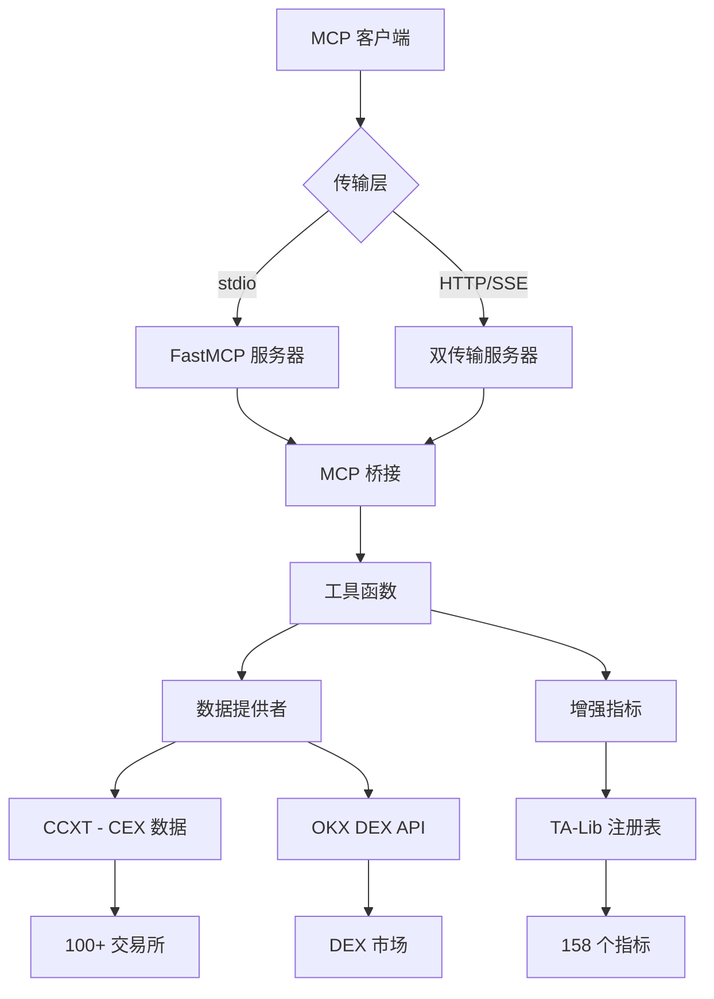

# Crypto PowerData MCP 服务

[](https://opensource.org/licenses/MIT)
[](https://www.python.org/downloads/)
[](https://modelcontextprotocol.io/)

> **一个功能全面的MCP（模型上下文协议）服务，用于加密货币数据采集，并具备先进的技术分析能力**

## 📋 目录

- [概览](#概览)
- [功能特性](#功能特性)
- [架构](#架构)
- [快速入门](#快速入门)
- [安装](#安装)
- [配置](#配置)
- [使用示例](#使用示例)
- [API文档](#api文档)
- [支持的指标](#支持的指标)
- [数据源](#数据源)
- [开发](#开发)
- [测试](#测试)
- [贡献](#贡献)
- [许可证](#许可证)

## 🎯 概览

Crypto PowerData MCP 服务是一个先进的加密货币数据采集服务，提供：

- **全面的TA-Lib集成**: 包含10大类158个技术指标
- **双传输协议支持**: 支持 stdio 和 HTTP/SSE 协议
- **多交易所接入**: 通过 CCXT 支持100+中心化交易所
- **DEX集成**: 通过 OKX DEX API 获取实时去中心化交易所数据
- **灵活的参数**: 支持同一指标使用不同参数的多个实例
- **智能标签**: 根据参数自动命名列

### 核心能力

🔄 **双传输协议**
- **stdio 传输** - 用于命令行和程序化访问的标准输入/输出
- **HTTP/SSE 传输** - 用于Web应用和实时数据流的服务器发送事件
- **自动检测** - 自动选择合适的传输方式
- **功能一致** - 两种协议提供相同的工具和功能

📊 **数据源**
1. **CEX 数据** - 来自100+中心化交易所的K线数据 (CCXT)
2. **DEX 数据** - 来自去中心化交易所的K线数据 (OKX DEX API)
3. **实时价格** - 来自DEX市场的当前代币价格

🧮 **技术分析**
- **158个TA-Lib指标**，支持灵活的多参数配置
- **增强的参数格式**: `{'ema': [{'timeperiod': 12}, {'timeperiod': 26}]}`
- **智能结果标签**: `ema_12`, `ema_26`, `macd_12_26_9`

## ✨ 功能特性

### 🔄 双传输架构
- **stdio 传输**: 用于命令行工具和本地集成的标准MCP协议
- **HTTP/SSE 传输**: 用于Web应用的带服务器发送事件的RESTful API
- **自动检测**: 根据环境智能选择传输方式
- **会话管理**: 带有正确清理机制的持久会话

### 📊 全面的技术分析
- **158个TA-Lib指标**，涵盖10个类别（动量、重叠、形态识别等）
- **多参数支持**: 同一指标使用不同参数的多个实例
- **灵活配置**: 基于JSON的参数规范及验证
- **智能标签**: 自动列命名 (例如, `ema_12`, `macd_12_26_9`)

### 🌐 多交易所支持
- **100+ CEX交易所**: 通过CCXT库 (Binance, Coinbase, Kraken等)
- **DEX集成**: 用于去中心化交易所数据的OKX DEX API
- **实时数据**: 当前价格和历史K线数据
- **多时间周期**: 从1分钟到1个月的间隔

### 🛡️ 强大的参数处理
- **字符串参数处理**: 处理MCP客户端的字符串输入
- **JSON解析**: 支持多种JSON格式和错误修正
- **验证**: 全面的参数验证和有用的错误信息
- **类型转换**: 字符串和原生类型之间的自动转换

## 🏗️ 架构



### 核心组件

- **MCP 桥接**: 传输协议和业务逻辑之间的统一接口
- **数据提供者**: 处理从CEX和DEX源获取数据
- **增强指标**: 具有灵活参数的先进技术分析
- **TA-Lib 注册表**: 包含所有可用指标及其元数据的完整注册表
- **双传输服务器**: 具有会话管理的HTTP/SSE服务器

## 🚀 快速入门

### 先决条件

- **Python 3.10+** 已安装在您的系统上
- **UV包管理器** ([安装指南](https://docs.astral.sh/uv/getting-started/installation/))
- **Git** 用于克隆仓库

### 1. 安装

```bash
# 克隆仓库
git clone https://github.com/veithly/crypto-powerdata-mcp.git
cd crypto-powerdata-mcp

# 使用 UV 安装依赖
uv sync

# 验证安装
uv run python -c "import src.main; print('✅ 安装成功!')"
```

### 2. 基本用法

#### 选项 A: stdio 传输 (默认)
```bash
# 启动 MCP 服务
uv run python -m src.main

# 使用提供的测试脚本进行测试
uv run python test_mcp_functionality.py
```

#### 选项 B: HTTP/SSE 传输
```bash
# 启动 HTTP 服务器
uv run python -m src.main --http

# 访问端点:
# - API: http://localhost:8000/mcp
# - 健康检查: http://localhost:8000/health
# - 文档: http://localhost:8000/
```

#### 选项 C: 自动检测模式
```bash
# 让服务器选择最佳传输方式
uv run python -m src.dual_transport_server --mode auto
```

### 3. 第一个API调用

```python
import asyncio
import json
from mcp import ClientSession, StdioServerParameters
from mcp.client.stdio import stdio_client

async def test_basic_functionality():
    server_params = StdioServerParameters(
        command="uv",
        args=["run", "python", "-m", "src.main"],
        cwd=".",
        env={"PYTHONPATH": "."}
    )

    async with stdio_client(server_params) as (read, write):
        async with ClientSession(read, write) as session:
            await session.initialize()

            # 获取可用指标
            result = await session.call_tool("get_available_indicators", {})
            print(f"可用指标数量: {len(json.loads(result.content[0].text))}")

if __name__ == "__main__":
    asyncio.run(test_basic_functionality())
```

## ⚙️ 配置

### 环境变量

在项目根目录创建一个 `.env` 文件进行配置:

```bash
# OKX DEX API 配置 (DEX功能必需)
OKX_API_KEY=your_api_key_here
OKX_SECRET_KEY=your_secret_key_here
OKX_API_PASSPHRASE=your_passphrase_here
OKX_PROJECT_ID=your_project_id_here

# 可选性能设置
RATE_LIMIT_REQUESTS_PER_SECOND=10
TIMEOUT_SECONDS=30
LOG_LEVEL=INFO

# 可选传输设置
DEFAULT_TRANSPORT=stdio
HTTP_HOST=127.0.0.1
HTTP_PORT=8000
```

### MCP 客户端配置

#### Claude Desktop 配置

添加到您的 Claude Desktop 配置文件:

```json
{
  "mcpServers": {
    "crypto-powerdata-mcp": {
      "command": "uv",
      "args": ["run", "python", "-m", "src.main"],
      "cwd": "/absolute/path/to/crypto-powerdata-mcp",
      "env": {
        "PYTHONPATH": ".",
        "OKX_API_KEY": "your_api_key",
        "OKX_SECRET_KEY": "your_secret_key",
        "OKX_API_PASSPHRASE": "your_passphrase",
        "OKX_PROJECT_ID": "your_project_id"
      }
    }
  }
}
```

## 💡 使用示例

### 基础示例

#### 1. 获取实时代币价格

```python
# 获取以太坊上USDC的当前价格
result = await session.call_tool("get_dex_token_price", {
    "chain_index": "1",  # Ethereum
    "token_address": "0xa0b86991c6218b36c1d19d4a2e9eb0ce3606eb48"  # USDC
})
```

#### 2. 获取CEX数据及指标

```python
# 从币安获取BTC/USDT数据及技术指标
result = await session.call_tool("get_cex_data_with_indicators", {
    "exchange": "binance",
    "symbol": "BTC/USDT",
    "timeframe": "1h",
    "limit": 100,
    "indicators_config": '{"ema": [{"timeperiod": 12}, {"timeperiod": 26}], "rsi": [{"timeperiod": 14}]}'
})
```

## 📚 API文档

### 可用工具

| 工具名称 | 描述 | 传输支持 |
|---|---|---|
| `get_enhanced_dex_data_with_indicators` | 带有灵活指标的高级DEX数据 | stdio, HTTP/SSE |
| `get_available_indicators` | 完整的指标注册表 | stdio, HTTP/SSE |
| `get_cex_data_with_indicators` | 带有增强指标的CEX数据 | stdio, HTTP/SSE |
| `get_dex_data_with_indicators` | 带有指标的DEX数据 (旧版) | stdio, HTTP/SSE |
| `get_dex_token_price` | 当前DEX代币价格 | stdio, HTTP/SSE |
| `get_cex_price` | 当前CEX价格 | stdio, HTTP/SSE |

## 📊 支持的指标

### 指标类别 (共158个)

| 类别 | 数量 | 示例 |
|---|---|---|
| **动量指标** | 30 | RSI, MACD, Stochastic, ADX, CCI, Williams %R, ROC |
| **重叠研究** | 17 | SMA, EMA, Bollinger Bands, KAMA, T3, TEMA |
| **形态识别** | 61 | Doji, Hammer, Engulfing, Three Black Crows, Morning Star |
| **成交量指标** | 3 | OBV, A/D Line, Chaikin A/D Oscillator |
| **波动率指标** | 3 | ATR, NATR, True Range |
| **价格转换** | 4 | Average Price, Median Price, Typical Price, Weighted Close |
| **周期指标** | 5 | Hilbert Transform Dominant Cycle Period, Trend Mode |
| **统计函数** | 9 | Beta, Correlation, Linear Regression, Standard Deviation |
| **数学转换** | 15 | ACOS, ASIN, ATAN, COS, SIN, TAN, SQRT, LN, LOG10 |
| **数学运算符** | 11 | ADD, SUB, MULT, DIV, MIN, MAX, SUM |

---

**Made with ❤️ for the cryptocurrency and AI communities**