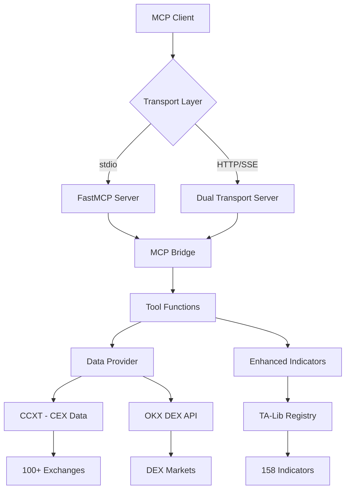

# Crypto PowerData MCP Service

[](https://opensource.org/licenses/MIT)
[](https://www.python.org/downloads/)
[](https://modelcontextprotocol.io/)

> **A comprehensive MCP (Model Context Protocol) service for cryptocurrency data acquisition with advanced technical analysis capabilities**

## 📋 Table of Contents

- [Overview](#overview)
- [Features](#features)
- [Architecture](#architecture)
- [Quick Start](#quick-start)
- [Installation](#installation)
- [Configuration](#configuration)
- [Usage Examples](#usage-examples)
- [API Documentation](#api-documentation)
- [Supported Indicators](#supported-indicators)
- [Data Sources](#data-sources)
- [Development](#development)
- [Testing](#testing)
- [Contributing](#contributing)
- [License](#license)

## 🎯 Overview

The Crypto PowerData MCP Service is an advanced cryptocurrency data acquisition service that provides:

- **Comprehensive TA-Lib Integration**: 158 technical indicators across 10 categories
- **Dual Transport Support**: Both stdio and HTTP/SSE protocols
- **Multi-Exchange Access**: 100+ centralized exchanges via CCXT
- **DEX Integration**: Real-time decentralized exchange data via OKX DEX API
- **Flexible Parameters**: Multiple instances of indicators with different parameters
- **Intelligent Labeling**: Automatic column naming based on parameters

### Key Capabilities

🔄 **Dual Transport Protocols**
- **stdio transport** - Standard input/output for command-line and programmatic access
- **HTTP/SSE transport** - Server-Sent Events for web applications and real-time data feeds
- **Auto-detection** - Automatically chooses appropriate transport method
- **Identical functionality** - Same tools and features across both protocols

📊 **Data Sources**
1. **CEX Data** - Candlestick data from 100+ centralized exchanges (CCXT)
2. **DEX Data** - Candlestick data from decentralized exchanges (OKX DEX API)
3. **Real-time Prices** - Current token prices from DEX markets

🧮 **Technical Analysis**
- **158 TA-Lib indicators** with flexible multi-parameter support
- **Enhanced parameter format**: `{'ema': [{'timeperiod': 12}, {'timeperiod': 26}]}`
- **Intelligent result labeling**: `ema_12`, `ema_26`, `macd_12_26_9`

## ✨ Features

### 🔄 Dual Transport Architecture
- **stdio Transport**: Standard MCP protocol for command-line tools and local integrations
- **HTTP/SSE Transport**: RESTful API with Server-Sent Events for web applications
- **Auto-Detection**: Intelligent transport selection based on environment
- **Session Management**: Persistent sessions with proper cleanup

### 📊 Comprehensive Technical Analysis
- **158 TA-Lib Indicators** across 10 categories (Momentum, Overlap, Pattern Recognition, etc.)
- **Multi-Parameter Support**: Multiple instances of same indicator with different parameters
- **Flexible Configuration**: JSON-based parameter specification with validation
- **Intelligent Labeling**: Automatic column naming (e.g., `ema_12`, `macd_12_26_9`)

### 🌐 Multi-Exchange Support
- **100+ CEX Exchanges**: Via CCXT library (Binance, Coinbase, Kraken, etc.)
- **DEX Integration**: OKX DEX API for decentralized exchange data
- **Real-time Data**: Current prices and historical candlestick data
- **Multiple Timeframes**: From 1 minute to 1 month intervals

### 🛡️ Robust Parameter Handling
- **String Parameter Processing**: Handles MCP client string inputs
- **JSON Parsing**: Supports various JSON formats and error correction
- **Validation**: Comprehensive parameter validation with helpful error messages
- **Type Conversion**: Automatic conversion between string and native types

## 🏗️ Architecture



### Core Components

- **MCP Bridge**: Unified interface between transport protocols and business logic
- **Data Provider**: Handles data fetching from CEX and DEX sources
- **Enhanced Indicators**: Advanced technical analysis with flexible parameters
- **TA-Lib Registry**: Complete registry of all available indicators with metadata
- **Dual Transport Server**: HTTP/SSE server with session management

## 🚀 Quick Start

### Prerequisites

- **Python 3.10+** installed on your system
- **UV package manager** ([installation guide](https://docs.astral.sh/uv/getting-started/installation/))
- **Git** for cloning the repository

### 1. Installation

```bash
# Clone the repository
git clone https://github.com/veithly/crypto-powerdata-mcp.git
cd crypto-powerdata-mcp

# Install dependencies using UV
uv sync

# Verify installation
uv run python -c "import src.main; print('✅ Installation successful!')"
```

### 2. Basic Usage

#### Option A: stdio Transport (Default)
```bash
# Start the MCP service
uv run python -m src.main

# Test with the provided test script
uv run python test_mcp_functionality.py
```

#### Option B: HTTP/SSE Transport
```bash
# Start HTTP server
uv run python -m src.main --http

# Access endpoints:
# - API: http://localhost:8000/mcp
# - Health: http://localhost:8000/health
# - Documentation: http://localhost:8000/
```

#### Option C: Auto-Detection Mode
```bash
# Let the server choose the best transport
uv run python -m src.dual_transport_server --mode auto
```

### 3. First API Call

```python
import asyncio
import json
from mcp import ClientSession, StdioServerParameters
from mcp.client.stdio import stdio_client

async def test_basic_functionality():
    server_params = StdioServerParameters(
        command="uv",
        args=["run", "python", "-m", "src.main"],
        cwd=".",
        env={"PYTHONPATH": "."}
    )

    async with stdio_client(server_params) as (read, write):
        async with ClientSession(read, write) as session:
            await session.initialize()

            # Get available indicators
            result = await session.call_tool("get_available_indicators", {})
            print(f"Available indicators: {len(json.loads(result.content[0].text))}")

if __name__ == "__main__":
    asyncio.run(test_basic_functionality())
```

## 📦 Installation

### System Requirements

- **Operating System**: Windows 10+, macOS 10.15+, or Linux (Ubuntu 18.04+)
- **Python**: 3.10 or higher
- **Memory**: Minimum 2GB RAM (4GB recommended for large datasets)
- **Storage**: 500MB free space for dependencies

### Dependencies

The service automatically installs the following key dependencies:

- **MCP Framework**: `mcp>=1.0.0` - Model Context Protocol implementation
- **CCXT**: `ccxt>=4.0.0` - Cryptocurrency exchange trading library
- **TA-Lib**: `ta-lib>=0.4.25` - Technical analysis library
- **FastAPI**: `fastapi>=0.104.0` - Modern web framework for HTTP transport
- **Pandas**: `pandas>=2.0.0` - Data manipulation and analysis
- **NumPy**: `numpy>=1.24.0` - Numerical computing

### Installation Methods

#### Method 1: Using UV (Recommended)

```bash
# Install UV if not already installed
curl -LsSf https://astral.sh/uv/install.sh | sh

# Clone and install
git clone https://github.com/veithly/crypto-powerdata-mcp.git
cd crypto-powerdata-mcp
uv sync
```

#### Method 2: Using pip

```bash
git clone https://github.com/veithly/crypto-powerdata-mcp.git
cd crypto-powerdata-mcp
pip install -e .
```

#### Method 3: Development Installation

```bash
git clone https://github.com/veithly/crypto-powerdata-mcp.git
cd crypto-powerdata-mcp
uv sync --dev  # Includes development dependencies
```

### TA-Lib Installation

TA-Lib requires additional system-level installation:

#### Windows
```bash
# Using conda (recommended)
conda install -c conda-forge ta-lib

# Or download pre-compiled wheels
pip install TA-Lib
```

#### macOS
```bash
brew install ta-lib
pip install TA-Lib
```

#### Linux (Ubuntu/Debian)
```bash
sudo apt-get install libta-lib-dev
pip install TA-Lib
```

## ⚙️ Configuration

### Environment Variables

Create a `.env` file in the project root for configuration:

```bash
# OKX DEX API Configuration (Required for DEX features)
OKX_API_KEY=your_api_key_here
OKX_SECRET_KEY=your_secret_key_here
OKX_API_PASSPHRASE=your_passphrase_here
OKX_PROJECT_ID=your_project_id_here

# Optional Performance Settings
RATE_LIMIT_REQUESTS_PER_SECOND=10
TIMEOUT_SECONDS=30
LOG_LEVEL=INFO

# Optional Transport Settings
DEFAULT_TRANSPORT=stdio
HTTP_HOST=127.0.0.1
HTTP_PORT=8000
```

### OKX API Setup

1. **Create OKX Account**: Visit [OKX](https://www.okx.com/) and create an account
2. **Generate API Keys**: Go to API Management in your account settings
3. **Enable DEX API**: Ensure DEX API access is enabled for your API key
4. **Configure Permissions**: Set appropriate permissions for market data access

### MCP Client Configuration

#### Claude Desktop Configuration

Add to your Claude Desktop configuration file:

```json
{
  "mcpServers": {
    "crypto-powerdata-mcp": {
      "command": "uv",
      "args": ["run", "python", "-m", "src.main"],
      "cwd": "/absolute/path/to/crypto-powerdata-mcp",
      "env": {
        "PYTHONPATH": ".",
        "OKX_API_KEY": "your_api_key",
        "OKX_SECRET_KEY": "your_secret_key",
        "OKX_API_PASSPHRASE": "your_passphrase",
        "OKX_PROJECT_ID": "your_project_id"
      }
    }
  }
}
```

#### MCP Studio Configuration

```json
{
  "name": "Crypto PowerData MCP",
  "command": ["uv", "run", "python", "-m", "src.main"],
  "env": {
    "PYTHONPATH": "/path/to/crypto-powerdata-mcp"
  }
}
```

## 💡 Usage Examples

### Basic Examples

#### 1. Get Real-time Token Price

```python
# Get current USDC price on Ethereum
result = await session.call_tool("get_dex_token_price", {
    "chain_index": "1",  # Ethereum
    "token_address": "0xa0b86991c6218b36c1d19d4a2e9eb0ce3606eb48"  # USDC
})
```

#### 2. Fetch CEX Data with Indicators

```python
# Get BTC/USDT data from Binance with technical indicators
result = await session.call_tool("get_cex_data_with_indicators", {
    "exchange": "binance",
    "symbol": "BTC/USDT",
    "timeframe": "1h",
    "limit": 100,
    "indicators_config": '{"ema": [{"timeperiod": 12}, {"timeperiod": 26}], "rsi": [{"timeperiod": 14}]}'
})
```

#### 3. Advanced Multi-Indicator Analysis

```python
# Complex indicator configuration
indicators_config = {
    "ema": [{"timeperiod": 12}, {"timeperiod": 26}, {"timeperiod": 50}],
    "macd": [{"fastperiod": 12, "slowperiod": 26, "signalperiod": 9}],
    "rsi": [{"timeperiod": 14}, {"timeperiod": 21}],
    "bbands": [{"timeperiod": 20, "nbdevup": 2, "nbdevdn": 2}],
    "stoch": [{"fastkperiod": 5, "slowkperiod": 3, "slowdperiod": 3}]
}

result = await session.call_tool("get_enhanced_dex_data_with_indicators", {
    "chain_index": "1",
    "token_address": "0xa0b86991c6218b36c1d19d4a2e9eb0ce3606eb48",
    "timeframe": "1h",
    "limit": 200,
    "indicators_config": json.dumps(indicators_config)
})
```

### Advanced Usage Patterns

#### Pattern Recognition Analysis

```python
# Candlestick pattern recognition
pattern_config = {
    "cdldoji": [{}],
    "cdlhammer": [{}],
    "cdlengulfing": [{}],
    "cdl3blackcrows": [{}],
    "cdlmorningstar": [{}]
}

result = await session.call_tool("get_enhanced_dex_data_with_indicators", {
    "chain_index": "1",
    "token_address": "0xa0b86991c6218b36c1d19d4a2e9eb0ce3606eb48",
    "timeframe": "4h",
    "limit": 100,
    "indicators_config": json.dumps(pattern_config)
})
```

#### Multi-Timeframe Analysis

```python
# Analyze same asset across different timeframes
timeframes = ["1h", "4h", "1d"]
results = {}

for tf in timeframes:
    result = await session.call_tool("get_enhanced_dex_data_with_indicators", {
        "chain_index": "1",
        "token_address": "0xa0b86991c6218b36c1d19d4a2e9eb0ce3606eb48",
        "timeframe": tf,
        "limit": 50,
        "indicators_config": '{"ema": [{"timeperiod": 20}], "rsi": [{"timeperiod": 14}]}'
    })
    results[tf] = result
```

## 📚 API Documentation

### Available Tools

| Tool Name | Description | Transport Support |
|-----------|-------------|-------------------|
| `get_enhanced_dex_data_with_indicators` | Advanced DEX data with flexible indicators | stdio, HTTP/SSE |
| `get_available_indicators` | Complete indicator registry | stdio, HTTP/SSE |
| `get_cex_data_with_indicators` | CEX data with enhanced indicators | stdio, HTTP/SSE |
| `get_dex_data_with_indicators` | DEX data with indicators (legacy) | stdio, HTTP/SSE |
| `get_dex_token_price` | Current DEX token price | stdio, HTTP/SSE |
| `get_cex_price` | Current CEX price | stdio, HTTP/SSE |

### Tool Specifications

#### `get_enhanced_dex_data_with_indicators`

**Purpose**: Fetch DEX candlestick data with comprehensive technical indicators

**Parameters**:
- `chain_index` (string, required): Blockchain identifier ("1" for Ethereum, "56" for BSC, etc.)
- `token_address` (string, required): Token contract address (42-character hex string)
- `timeframe` (string, optional): Time interval ("1m", "5m", "15m", "1h", "4h", "1d", "1w")
- `limit` (integer, optional): Number of candles to fetch (default: 100, max: 1000)
- `indicators_config` (string, required): JSON string with indicator configurations

**Example Request**:
```json
{
  "chain_index": "1",
  "token_address": "0xa0b86991c6218b36c1d19d4a2e9eb0ce3606eb48",
  "timeframe": "1h",
  "limit": 100,
  "indicators_config": "{\"ema\": [{\"timeperiod\": 12}, {\"timeperiod\": 26}], \"rsi\": [{\"timeperiod\": 14}]}"
}
```

**Response Format**:
```json
{
  "success": true,
  "data": {
    "candles": [...],
    "indicators": {
      "ema_12": [...],
      "ema_26": [...],
      "rsi_14": [...]
    },
    "metadata": {
      "symbol": "USDC",
      "timeframe": "1h",
      "count": 100
    }
  }
}
```

## 📊 Supported Indicators

### Indicator Categories (158 Total)

| Category | Count | Examples |
|----------|-------|----------|
| **Momentum Indicators** | 30 | RSI, MACD, Stochastic, ADX, CCI, Williams %R, ROC |
| **Overlap Studies** | 17 | SMA, EMA, Bollinger Bands, KAMA, T3, TEMA |
| **Pattern Recognition** | 61 | Doji, Hammer, Engulfing, Three Black Crows, Morning Star |
| **Volume Indicators** | 3 | OBV, A/D Line, Chaikin A/D Oscillator |
| **Volatility Indicators** | 3 | ATR, NATR, True Range |
| **Price Transform** | 4 | Average Price, Median Price, Typical Price, Weighted Close |
| **Cycle Indicators** | 5 | Hilbert Transform Dominant Cycle Period, Trend Mode |
| **Statistic Functions** | 9 | Beta, Correlation, Linear Regression, Standard Deviation |
| **Math Transform** | 15 | ACOS, ASIN, ATAN, COS, SIN, TAN, SQRT, LN, LOG10 |
| **Math Operators** | 11 | ADD, SUB, MULT, DIV, MIN, MAX, SUM |

### Parameter Format Examples

#### Basic Indicators
```json
{
  "sma": [{"timeperiod": 20}],
  "ema": [{"timeperiod": 12}, {"timeperiod": 26}],
  "rsi": [{"timeperiod": 14}]
}
```

#### Advanced Indicators
```json
{
  "macd": [{"fastperiod": 12, "slowperiod": 26, "signalperiod": 9}],
  "bbands": [{"timeperiod": 20, "nbdevup": 2, "nbdevdn": 2}],
  "stoch": [{"fastkperiod": 5, "slowkperiod": 3, "slowdperiod": 3}]
}
```

#### Pattern Recognition
```json
{
  "cdldoji": [{}],
  "cdlhammer": [{}],
  "cdlengulfing": [{}]
}
```

### Result Column Naming

The service automatically generates descriptive column names based on parameters:

- **Single Parameter**: `indicator_value` (e.g., `rsi_14`, `sma_20`)
- **Multiple Parameters**: `indicator_param1_param2_...` (e.g., `macd_12_26_9`)
- **Multiple Outputs**: `indicator_params_output` (e.g., `bbands_2_2_20_upperband`)

### Popular Indicator Combinations

#### Trend Following Strategy
```json
{
  "ema": [{"timeperiod": 12}, {"timeperiod": 26}, {"timeperiod": 50}],
  "macd": [{"fastperiod": 12, "slowperiod": 26, "signalperiod": 9}],
  "adx": [{"timeperiod": 14}]
}
```

#### Mean Reversion Strategy
```json
{
  "rsi": [{"timeperiod": 14}],
  "bbands": [{"timeperiod": 20, "nbdevup": 2, "nbdevdn": 2}],
  "stoch": [{"fastkperiod": 5, "slowkperiod": 3, "slowdperiod": 3}]
}
```

#### Momentum Analysis
```json
{
  "rsi": [{"timeperiod": 14}, {"timeperiod": 21}],
  "cci": [{"timeperiod": 14}],
  "willr": [{"timeperiod": 14}],
  "roc": [{"timeperiod": 10}]
}
```

## 🌐 Data Sources

### Centralized Exchanges (CEX)

**Supported via CCXT Library (100+ exchanges)**:

#### Major Exchanges
- **Binance** - World's largest cryptocurrency exchange
- **Coinbase** - Leading US-based exchange
- **Kraken** - Established European exchange
- **Bitfinex** - Advanced trading features
- **Huobi** - Global cryptocurrency exchange
- **OKX** - Comprehensive trading platform

#### Regional Exchanges
- **Bitstamp** - European exchange
- **Gemini** - Regulated US exchange
- **KuCoin** - Global altcoin exchange
- **Gate.io** - Wide variety of trading pairs
- **Bybit** - Derivatives trading platform

### Decentralized Exchanges (DEX)

**Supported via OKX DEX API**:

#### Supported Blockchains
| Chain | Chain Index | Native Token | Popular DEXs |
|-------|-------------|--------------|--------------|
| **Ethereum** | 1 | ETH | Uniswap, SushiSwap, 1inch |
| **BSC** | 56 | BNB | PancakeSwap, Venus |
| **Polygon** | 137 | MATIC | QuickSwap, SushiSwap |
| **Avalanche** | 43114 | AVAX | Trader Joe, Pangolin |
| **Arbitrum** | 42161 | ETH | Uniswap V3, SushiSwap |
| **Optimism** | 10 | ETH | Uniswap V3, Synthetix |

#### Popular Token Addresses

**Ethereum (chain_index: "1")**:
```
USDC: 0xa0b86991c6218b36c1d19d4a2e9eb0ce3606eb48
USDT: 0xdac17f958d2ee523a2206206994597c13d831ec7
WETH: 0xc02aaa39b223fe8d0a0e5c4f27ead9083c756cc2
DAI:  0x6b175474e89094c44da98b954eedeac495271d0f
```

**BSC (chain_index: "56")**:
```
WBNB: 0xbb4cdb9cbd36b01bd1cbaebf2de08d9173bc095c
BUSD: 0xe9e7cea3dedca5984780bafc599bd69add087d56
CAKE: 0x0e09fabb73bd3ade0a17ecc321fd13a19e81ce82
```

## 🛠️ Development

### Project Structure

```
crypto-powerdata-mcp/
├── src/
│   ├── main.py                 # Main MCP server entry point
│   ├── data_provider.py        # Data fetching and processing
│   ├── enhanced_indicators.py  # Advanced technical analysis
│   ├── talib_registry.py       # TA-Lib indicator registry
│   ├── mcp_bridge.py          # Transport protocol bridge
│   └── dual_transport_server.py # HTTP/SSE server
├── tests/
│   ├── test_enhanced_mcp.py    # Comprehensive test suite
│   ├── test_mcp_functionality.py # Basic functionality tests
│   └── comprehensive_mcp_test.py # Advanced testing
├── docs/
│   ├── API_DOCUMENTATION.md    # Detailed API reference
│   ├── CONFIGURATION.md        # Configuration guide
│   └── TESTING_REPORT.md       # Testing documentation
├── config_examples.py          # Configuration examples
├── pyproject.toml             # Project dependencies
├── README.md                  # This file
└── LICENSE                    # MIT license
```

### Development Setup

```bash
# Clone repository
git clone https://github.com/veithly/crypto-powerdata-mcp.git
cd crypto-powerdata-mcp

# Install development dependencies
uv sync --dev

# Install pre-commit hooks
pre-commit install

# Run tests
pytest

# Run linting
black src/ tests/
isort src/ tests/
flake8 src/ tests/
mypy src/
```

### Adding New Indicators

1. **Register in TA-Lib Registry** (`src/talib_registry.py`):
```python
def register_custom_indicator(self):
    self.indicators["custom_indicator"] = IndicatorDefinition(
        name="custom_indicator",
        category=IndicatorCategory.MOMENTUM,
        description="Custom indicator description",
        # ... other parameters
    )
```

2. **Implement Calculation** (`src/enhanced_indicators.py`):
```python
def calculate_custom_indicator(self, data, params):
    # Implementation here
    return result
```

3. **Add Tests** (`tests/test_enhanced_mcp.py`):
```python
def test_custom_indicator():
    # Test implementation
    pass
```

## 🧪 Testing

### Test Suite Overview

The project includes comprehensive testing to ensure reliability and functionality:

#### Available Test Files

1. **`test_enhanced_mcp.py`** - Comprehensive test suite for enhanced MCP features
   - Tests all 158 TA-Lib indicators
   - Validates multi-parameter support
   - Checks transport protocols
   - Error handling scenarios

2. **`test_mcp_functionality.py`** - Basic functionality demonstration
   - Simple usage examples
   - Integration testing
   - Client-server communication

3. **`comprehensive_mcp_test.py`** - Advanced testing scenarios
   - Performance testing
   - Edge case handling
   - Real-world usage patterns

### Running Tests

#### Quick Test
```bash
# Run basic functionality test
uv run python test_mcp_functionality.py
```

#### Comprehensive Testing
```bash
# Run all tests with pytest
pytest tests/ -v

# Run specific test file
pytest test_enhanced_mcp.py -v

# Run with coverage
pytest --cov=src --cov-report=html
```

#### Manual Testing
```bash
# Test enhanced indicators system
uv run python -c "
import asyncio
from src.enhanced_indicators import EnhancedTechnicalAnalysis
import pandas as pd
import numpy as np

async def test():
    ta = EnhancedTechnicalAnalysis()

    # Create sample data
    dates = pd.date_range('2024-01-01', periods=100, freq='1H')
    data = pd.DataFrame({
        'open': np.random.uniform(50000, 51000, 100),
        'high': np.random.uniform(50500, 51500, 100),
        'low': np.random.uniform(49500, 50500, 100),
        'close': np.random.uniform(50000, 51000, 100),
        'volume': np.random.uniform(100, 1000, 100)
    }, index=dates)

    # Test indicators
    config = {
        'ema': [{'timeperiod': 12}, {'timeperiod': 26}],
        'rsi': [{'timeperiod': 14}],
        'macd': [{'fastperiod': 12, 'slowperiod': 26, 'signalperiod': 9}]
    }

    result = ta.calculate_indicators(data, config)
    print(f'✅ Calculated {len(result.columns)} columns')
    print(f'📊 Indicators: {[col for col in result.columns if col not in data.columns]}')

asyncio.run(test())
"
```

### Performance Testing

```bash
# Test HTTP transport performance
curl -X POST http://localhost:8000/mcp \
  -H "Content-Type: application/json" \
  -d '{
    "jsonrpc": "2.0",
    "method": "initialize",
    "params": {"protocolVersion": "2024-11-05"},
    "id": 1
  }'
```

### Troubleshooting Tests

#### Common Issues

1. **Import Errors**
   ```bash
   # Solution: Set PYTHONPATH
   export PYTHONPATH=/path/to/crypto-powerdata-mcp
   ```

2. **TA-Lib Installation Issues**
   ```bash
   # Windows
   conda install -c conda-forge ta-lib

   # macOS
   brew install ta-lib
   pip install ta-lib

   # Linux
   sudo apt-get install libta-lib-dev
   pip install ta-lib
   ```

3. **API Rate Limits**
   ```bash
   # Solution: Reduce request rate
   export RATE_LIMIT_REQUESTS_PER_SECOND=5
   ```

4. **Memory Issues**
   ```bash
   # Solution: Use smaller datasets
   # Reduce limit parameter in API calls
   ```

### Debug Mode

```bash
# Enable detailed logging
export LOG_LEVEL=DEBUG
uv run python -m src.main
```

## 🤝 Contributing

We welcome contributions to the Crypto PowerData MCP service! Here's how you can help:

### Ways to Contribute

1. **Bug Reports** - Report issues via GitHub Issues
2. **Feature Requests** - Suggest new features or improvements
3. **Code Contributions** - Submit pull requests for bug fixes or new features
4. **Documentation** - Improve documentation and examples
5. **Testing** - Add test cases or improve existing tests

### Development Workflow

1. **Fork the Repository**
   ```bash
   git clone https://github.com/veithly/crypto-powerdata-mcp.git
   cd crypto-powerdata-mcp
   ```

2. **Create a Feature Branch**
   ```bash
   git checkout -b feature/your-feature-name
   ```

3. **Set Up Development Environment**
   ```bash
   uv sync --dev
   pre-commit install
   ```

4. **Make Your Changes**
   - Follow the existing code style
   - Add tests for new features
   - Update documentation as needed

5. **Run Tests**
   ```bash
   pytest tests/ -v
   black src/ tests/
   isort src/ tests/
   flake8 src/ tests/
   mypy src/
   ```

6. **Commit and Push**
   ```bash
   git add .
   git commit -m "feat: add your feature description"
   git push origin feature/your-feature-name
   ```

7. **Create Pull Request**
   - Provide clear description of changes
   - Reference any related issues
   - Ensure all tests pass

### Code Style Guidelines

- **Python Style**: Follow PEP 8 with Black formatting
- **Type Hints**: Use type hints for all function parameters and returns
- **Documentation**: Add docstrings for all public functions and classes
- **Testing**: Maintain test coverage above 80%

### Adding New Features

#### Adding Exchange Support
1. Extend `data_provider.py` with new exchange integration
2. Add configuration options in `main.py`
3. Create comprehensive tests
4. Update documentation

#### Adding New Indicators
1. Register in `talib_registry.py`
2. Implement calculation in `enhanced_indicators.py`
3. Add parameter validation
4. Create test cases
5. Update API documentation

### Reporting Issues

When reporting bugs, please include:
- Python version and operating system
- Complete error messages and stack traces
- Steps to reproduce the issue
- Expected vs actual behavior
- Relevant configuration details

### Feature Requests

For feature requests, please provide:
- Clear description of the proposed feature
- Use cases and benefits
- Potential implementation approach
- Any relevant examples or references

## 📄 License

This project is licensed under the MIT License - see the [LICENSE](LICENSE) file for details.

### MIT License Summary

- ✅ **Commercial Use** - Use in commercial projects
- ✅ **Modification** - Modify the source code
- ✅ **Distribution** - Distribute the software
- ✅ **Private Use** - Use for private projects
- ❌ **Liability** - No warranty or liability
- ❌ **Warranty** - No warranty provided

### Third-Party Licenses

This project uses several open-source libraries:
- **TA-Lib** - BSD License
- **CCXT** - MIT License
- **FastAPI** - MIT License
- **Pandas** - BSD License
- **NumPy** - BSD License

## 🙏 Acknowledgments

Special thanks to the following projects and communities:

- **[TA-Lib](https://ta-lib.org/)** - Technical Analysis Library for comprehensive indicator calculations
- **[CCXT](https://github.com/ccxt/ccxt)** - Cryptocurrency Exchange Trading Library for multi-exchange support
- **[OKX](https://www.okx.com/)** - DEX API provider for decentralized exchange data
- **[FastMCP](https://github.com/jlowin/fastmcp)** - Model Context Protocol framework
- **[FastAPI](https://fastapi.tiangolo.com/)** - Modern web framework for HTTP transport
- **[Model Context Protocol](https://modelcontextprotocol.io/)** - Protocol specification and community

### Contributors

- Initial development and architecture
- Technical analysis system design
- Dual transport protocol implementation
- Comprehensive testing framework
- Documentation and examples

---

## 📞 Support

- **Documentation**: [API Documentation](API_DOCUMENTATION.md) | [Configuration Guide](CONFIGURATION.md)
- **Issues**: [GitHub Issues](https://github.com/veithly/crypto-powerdata-mcp/issues)
- **Discussions**: [GitHub Discussions](https://github.com/veithly/crypto-powerdata-mcp/discussions)
- **Email**: dev@example.com

---

**Made with ❤️ for the cryptocurrency and AI communities**

